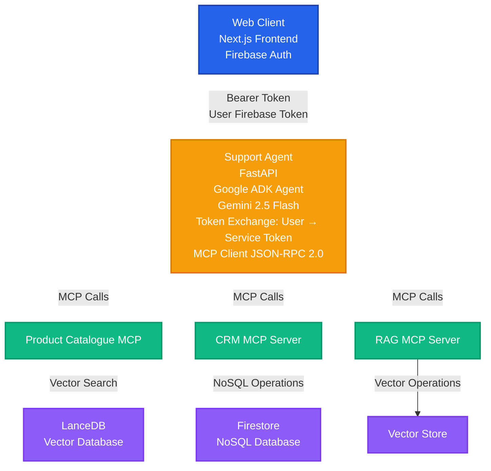

# Architecture Overview

This series walks through building a production-ready AI agent system deployed on Google Cloud Platform. We'll cover everything from architecture design to deployment, security, and monitoring.

## System Architecture

The system implements a microservices architecture with the following key components:

## Key Design Patterns

### 1. Token Exchange Pattern

User Firebase tokens are validated, then the agent uses a service account token for MCP calls. This ensures:
- **User authentication**: End users authenticate via Firebase
- **Service-to-service security**: MCP servers verify service account tokens
- **Permission isolation**: User permissions are separate from service permissions

### 2. MCP (Model Context Protocol)

Standardized JSON-RPC 2.0 interface for agent-to-service communication:
- **Consistent interface**: All MCP servers follow the same protocol
- **Tool discovery**: Agents can discover available tools dynamically
- **Type safety**: Structured request/response formats

### 3. Microservice Architecture

Each MCP server is independently deployable and scalable:
- **Product Catalogue MCP**: Handles product search and retrieval
- **CRM MCP**: Manages customer data operations
- **Support Agent**: Orchestrates conversations and tool calls

### 4. FastMCP Integration

Uses Google ADK's FastMCP for tool definitions and protocol handling:
- **Type-safe tools**: Python decorators define tool schemas
- **Automatic protocol handling**: JSON-RPC 2.0 formatting handled automatically
- **Error handling**: Built-in error response formatting

## Technology Stack

- **Frontend**: Next.js with Firebase Authentication
- **Support Agent**: FastAPI + Google ADK (Gemini 2.5 Flash)
- **MCP Servers**: FastAPI + FastMCP
- **Databases**: 
  - LanceDB (vector database for product search)
  - Firestore (NoSQL for CRM data)
- **Cloud Platform**: Google Cloud Platform
  - Cloud Run (containerized services)
  - Firebase (authentication, hosting)
  - Secret Manager (service account keys)

## What You'll Learn

Throughout this series, you'll learn:

1. **Architecture Design**: How to structure a cloud-native agent system
2. **Authentication & Security**: Token exchange patterns and permission models
3. **MCP Protocol**: Implementing standardized agent-to-service communication
4. **Agent Development**: Building agents with Google ADK
5. **MCP Server Development**: Creating scalable backend services
6. **Deployment**: Deploying to Cloud Run with proper configuration
7. **Monitoring & Maintenance**: Observability and troubleshooting strategies

## Next Steps

In the next article, we'll dive into the **System Components**, exploring each service in detail and understanding their responsibilities.

