# Deployment Architecture

This article covers deployment architectures for both local development and cloud production environments.

## Local Development (Docker Compose)

### Docker Compose Configuration

```yaml
version: '3.8'

services:
  support-agent-adk:
    build: ./agents/support-agent-adk
    ports:
      - "8000:8000"
    environment:
      - FIREBASE_PROJECT_ID=<PROJECT_ID>
      - CATALOGUE_MCP_URL=http://mcp-product-catalogue:8000
      - CRM_MCP_URL=http://mcp-crm:8000
      - CORS_ORIGINS=http://localhost:3000
    volumes:
      - ./common/auth:/app/common/auth
    networks:
      - agentic-network

  mcp-product-catalogue:
    build: ./mcp/mcp-product-catalogue
    ports:
      - "8001:8000"
    environment:
      - FIREBASE_PROJECT_ID=<PROJECT_ID>
      - GOOGLE_CLOUD_PROJECT=<PROJECT_ID>
      - FIREBASE_SERVICE_ACCOUNT_PATH=/app/common/auth/firebase-service-account.json
    volumes:
      - ./common/auth:/app/common/auth
      - ./data/lancedb:/data
    networks:
      - agentic-network

  mcp-crm:
    build: ./mcp/mcp-crm
    ports:
      - "8002:8000"
    environment:
      - FIREBASE_PROJECT_ID=<PROJECT_ID>
      - GOOGLE_CLOUD_PROJECT=<PROJECT_ID>
      - FIREBASE_SERVICE_ACCOUNT_PATH=/app/common/auth/firebase-service-account.json
    volumes:
      - ./common/auth:/app/common/auth
    networks:
      - agentic-network

networks:
  agentic-network:
    driver: bridge
```

### Running Locally

```bash
# Start all services
docker-compose up -d

# View logs
docker-compose logs -f support-agent-adk
docker-compose logs -f mcp-product-catalogue
docker-compose logs -f mcp-crm

# Stop all services
docker-compose down
```

### Service URLs

- Support Agent: `http://localhost:8000`
- Product Catalogue MCP: `http://localhost:8001`
- CRM MCP: `http://localhost:8002`

## Cloud Deployment Architecture

### Google Cloud Platform Services

```mermaid
graph TD
    subgraph GCP["Google Cloud Platform"]
        subgraph Frontend["Frontend Layer"]
            F1[Firebase Hosting<br/>Next.js Web App<br/>https://project-id.web.app]
            W1[WhatsApp Channel<br/>WhatsApp Business API]
        end
        
        subgraph Auth["Authentication"]
            A1[Firebase Auth]
        end
        
        subgraph Services["Cloud Run Services"]
            S1[Support Agent<br/>FastAPI<br/>agent-order-receiver-xxx.run.app]
            S2[Product Catalogue MCP<br/>mcp-product-catalogue-xxx.run.app<br/>LanceDB Vector DB]
            S3[CRM MCP<br/>mcp-crm-xxx.run.app<br/>Firestore]
            S4[WhatsApp Webhook<br/>whatsapp-webhook-xxx.run.app]
        end
        
        subgraph CloudServices["Google Cloud Services"]
            C1[Secret Manager<br/>Service Account Keys]
            C2[Cloud Logging]
            C3[Cloud Monitoring]
            C4[IAM<br/>Identity & Access Management]
        end
    end
    
    F1 -->|Firebase Auth| A1
    W1 -->|Firebase Auth| A1
    A1 -->|Bearer Token| S1
    A1 -->|Bearer Token| S4
    S1 -->|MCP Calls| S2
    S1 -->|MCP Calls| S3
    S4 -->|Webhook| S1
    S2 -.->|Uses| C1
    S3 -.->|Uses| C1
    S4 -.->|Uses| C1
    S1 -.->|Logs| C2
    S2 -.->|Logs| C2
    S3 -.->|Logs| C2
    S4 -.->|Logs| C2
    S1 -.->|Metrics| C3
    S2 -.->|Metrics| C3
    S3 -.->|Metrics| C3
    S4 -.->|Metrics| C3
    S1 -.->|Permissions| C4
    S2 -.->|Permissions| C4
    S3 -.->|Permissions| C4
    S4 -.->|Permissions| C4
    
    style F1 fill:#2563eb,stroke:#1e40af,stroke-width:2px,color:#fff
    style W1 fill:#2563eb,stroke:#1e40af,stroke-width:2px,color:#fff
    style A1 fill:#3b82f6,stroke:#2563eb,stroke-width:2px,color:#fff
    style S1 fill:#f59e0b,stroke:#d97706,stroke-width:2px,color:#fff
    style S2 fill:#10b981,stroke:#059669,stroke-width:2px,color:#fff
    style S3 fill:#10b981,stroke:#059669,stroke-width:2px,color:#fff
    style S4 fill:#10b981,stroke:#059669,stroke-width:2px,color:#fff
    style C1 fill:#8b5cf6,stroke:#7c3aed,stroke-width:2px,color:#fff
    style C2 fill:#8b5cf6,stroke:#7c3aed,stroke-width:2px,color:#fff
    style C3 fill:#8b5cf6,stroke:#7c3aed,stroke-width:2px,color:#fff
    style C4 fill:#8b5cf6,stroke:#7c3aed,stroke-width:2px,color:#fff
    
    linkStyle 0 stroke:#ffffff,stroke-width:2px
    linkStyle 1 stroke:#ffffff,stroke-width:2px
    linkStyle 2 stroke:#ffffff,stroke-width:2px
    linkStyle 3 stroke:#ffffff,stroke-width:2px
    linkStyle 4 stroke:#ffffff,stroke-width:2px
    linkStyle 5 stroke:#999999,stroke-width:3px,stroke-dasharray: 5 5
    linkStyle 6 stroke:#999999,stroke-width:3px,stroke-dasharray: 5 5
    linkStyle 7 stroke:#999999,stroke-width:3px,stroke-dasharray: 5 5
    linkStyle 8 stroke:#999999,stroke-width:3px,stroke-dasharray: 5 5
    linkStyle 9 stroke:#999999,stroke-width:3px,stroke-dasharray: 5 5
    linkStyle 10 stroke:#999999,stroke-width:3px,stroke-dasharray: 5 5
    linkStyle 11 stroke:#999999,stroke-width:3px,stroke-dasharray: 5 5
    linkStyle 12 stroke:#999999,stroke-width:3px,stroke-dasharray: 5 5
    linkStyle 13 stroke:#999999,stroke-width:3px,stroke-dasharray: 5 5
    linkStyle 14 stroke:#999999,stroke-width:3px,stroke-dasharray: 5 5
    linkStyle 15 stroke:#999999,stroke-width:3px,stroke-dasharray: 5 5
    linkStyle 16 stroke:#999999,stroke-width:3px,stroke-dasharray: 5 5
    linkStyle 17 stroke:#999999,stroke-width:3px,stroke-dasharray: 5 5
    linkStyle 18 stroke:#999999,stroke-width:3px,stroke-dasharray: 5 5
    linkStyle 19 stroke:#999999,stroke-width:3px,stroke-dasharray: 5 5
```



**ASCII Diagram (for reference):**

```
┌─────────────────────────────────────────────────────────────┐
│                    Google Cloud Platform                     │
│                                                              │
│  ┌──────────────────────────────────────────────────────┐  │
│  │           Firebase Hosting (Next.js Web App)         │  │
│  │  URL: https://{project-id}.web.app                   │  │
│  └──────────────┬───────────────────────────────────────┘  │
│                 │                                           │
│                 │ Firebase Auth                             │
│                 │                                           │
│  ┌──────────────▼───────────────────────────────────────┐  │
│  │      Cloud Run: Support Agent (FastAPI)               │  │
│  │  URL: https://agent-order-receiver-xxx.run.app        │  │
│  └──────────────┬───────────────────────────────────────┘  │
│                 │                                           │
│                 ├─────────────────┬─────────────────┐        │
│                 │                 │                 │        │
│  ┌──────────────▼──────┐  ┌──────▼──────┐  ┌──────▼──────┐ │
│  │ Cloud Run: Product  │  │ Cloud Run:  │  │ Cloud Run:  │ │
│  │ Catalogue MCP       │  │ CRM MCP     │  │ WhatsApp    │ │
│  │ URL: https://mcp-   │  │ URL: https://│  │ Webhook     │ │
│  │ product-catalogue-  │  │ mcp-crm-xxx │  │ URL: https://│ │
│  │ xxx.run.app         │  │ .run.app    │  │ whatsapp-   │ │
│  │ - LanceDB (Vector)  │  │ - Firestore │  │ webhook-xxx │ │
│  └─────────────────────┘  └─────────────┘  └──────┬───────┘ │
│                                                    │         │
│  ┌─────────────────────────────────────────────────▼───┐  │
│  │         Google Cloud Services                        │  │
│  │  - Secret Manager (Service Account Keys)              │  │
│  │  - Cloud Logging                                      │  │
│  │  - Cloud Monitoring                                   │  │
│  │  - IAM (Identity & Access Management)                │  │
│  └──────────────────────────────────────────────────────┘  │
└─────────────────────────────────────────────────────────────┘
```

## Cloud Run Configuration

### Support Agent

**Platform:** Google Cloud Run

**URL:** `https://agent-order-receiver-bd66ql2x7q-ts.a.run.app`

**Container:** Docker image from `agents/support-agent-adk/`

**Environment Variables:**
```bash
FIREBASE_PROJECT_ID=<PROJECT_ID>
CATALOGUE_MCP_URL=https://mcp-product-catalogue-bd66ql2x7q-ts.a.run.app
CRM_MCP_URL=https://mcp-crm-bd66ql2x7q-ts.a.run.app
CORS_ORIGINS=https://<PROJECT_ID>.web.app,https://<PROJECT_ID>.firebaseapp.com
PORT=8000
DEBUG_HTTP=false
```

**Secrets:** Firebase service account JSON (via Secret Manager)

**Deployment Command:**
```bash
gcloud run deploy agent-order-receiver \
  --source ./agents/support-agent-adk \
  --platform managed \
  --region australia-southeast1 \
  --allow-unauthenticated \
  --set-env-vars FIREBASE_PROJECT_ID=<PROJECT_ID> \
  --set-env-vars CATALOGUE_MCP_URL=https://mcp-product-catalogue-xxx.run.app \
  --set-env-vars CRM_MCP_URL=https://mcp-crm-xxx.run.app \
  --set-secrets FIREBASE_SERVICE_ACCOUNT=/secrets/firebase-service-account
```

### Product Catalogue MCP

**Platform:** Google Cloud Run

**URL:** `https://mcp-product-catalogue-bd66ql2x7q-ts.a.run.app`

**Container:** Docker image from `mcp/mcp-product-catalogue/`

**Environment Variables:**
```bash
FIREBASE_PROJECT_ID=<PROJECT_ID>
GOOGLE_CLOUD_PROJECT=<PROJECT_ID>
FIREBASE_SERVICE_ACCOUNT_PATH=/app/common/auth/firebase-service-account.json
PORT=8000
DEBUG_HTTP=false
```

**Secrets:** Firebase service account JSON (via Secret Manager)

**Persistent Storage:** LanceDB data stored in Cloud Storage bucket

### CRM MCP

**Platform:** Google Cloud Run

**URL:** `https://mcp-crm-bd66ql2x7q-ts.a.run.app`

**Container:** Docker image from `mcp/mcp-crm/`

**Environment Variables:**
```bash
FIREBASE_PROJECT_ID=<PROJECT_ID>
GOOGLE_CLOUD_PROJECT=<PROJECT_ID>
FIREBASE_SERVICE_ACCOUNT_PATH=/app/common/auth/firebase-service-account.json
PORT=8000
DEBUG_HTTP=false
```

**Database:** Google Firestore (managed NoSQL database)

## Deployment Checklist

### Pre-Deployment

- [ ] Firebase project created and configured
- [ ] Firebase Authentication enabled
- [ ] Firestore database created
- [ ] Service account created and key downloaded
- [ ] Secrets uploaded to Secret Manager
- [ ] Docker images built and tested locally
- [ ] Environment variables documented

### Deployment Steps

- [ ] Deploy Product Catalogue MCP to Cloud Run
- [ ] Deploy CRM MCP to Cloud Run
- [ ] Deploy Support Agent to Cloud Run
- [ ] Configure CORS on all Cloud Run services
- [ ] Set up Cloud Run service URLs in environment variables
- [ ] Test service-to-service communication
- [ ] Verify authentication flow

### Post-Deployment

- [ ] Test web app authentication
- [ ] Test agent communication from web app
- [ ] Test MCP server calls
- [ ] Set up Cloud Monitoring alerts
- [ ] Configure Cloud Logging
- [ ] Set up backup for Firestore
- [ ] Document Cloud URLs

## Environment Variables Summary

### Support Agent
```bash
FIREBASE_PROJECT_ID=<PROJECT_ID>
CATALOGUE_MCP_URL=https://mcp-product-catalogue-bd66ql2x7q-ts.a.run.app
CRM_MCP_URL=https://mcp-crm-bd66ql2x7q-ts.a.run.app
CORS_ORIGINS=https://<PROJECT_ID>.web.app,https://<PROJECT_ID>.firebaseapp.com
PORT=8000
DEBUG_HTTP=false
```

### MCP Servers
```bash
FIREBASE_PROJECT_ID=<PROJECT_ID>
GOOGLE_CLOUD_PROJECT=<PROJECT_ID>
FIREBASE_SERVICE_ACCOUNT_PATH=/app/common/auth/firebase-service-account.json
PORT=8000
DEBUG_HTTP=false
```

## Network Configuration

### Local Development
- All services on `agentic-monorepo_default` network
- Services communicate via service names (e.g., `mcp-product-catalogue:8000`)
- Port mapping for external access

### Cloud
- All services on Cloud Run (serverless)
- Services communicate via HTTPS URLs
- CORS configured for frontend access
- Service-to-service authentication via service account tokens

## Scaling Considerations

### Cloud Run Auto-Scaling
- **Min instances**: 0 (for cost savings)
- **Max instances**: 10 (adjust based on traffic)
- **Concurrency**: 80 requests per instance
- **CPU**: 1 vCPU per instance
- **Memory**: 512MB per instance

### Database Scaling
- **Firestore**: On-demand pricing, auto-scales
- **LanceDB**: Stored in Cloud Storage, read-only scaling

## Cost Optimization

- **Cloud Run**: Use min instances = 0 for cost savings
- **Firestore**: Use on-demand pricing for low traffic
- **Firebase Hosting**: Free tier includes 10GB storage, 360MB/day transfer
- **Cloud Storage**: Use standard storage class for LanceDB data

## Next Steps

In the next article, we'll provide a **Cloud Deployment Guide** with step-by-step instructions for deploying to Google Cloud Platform.

